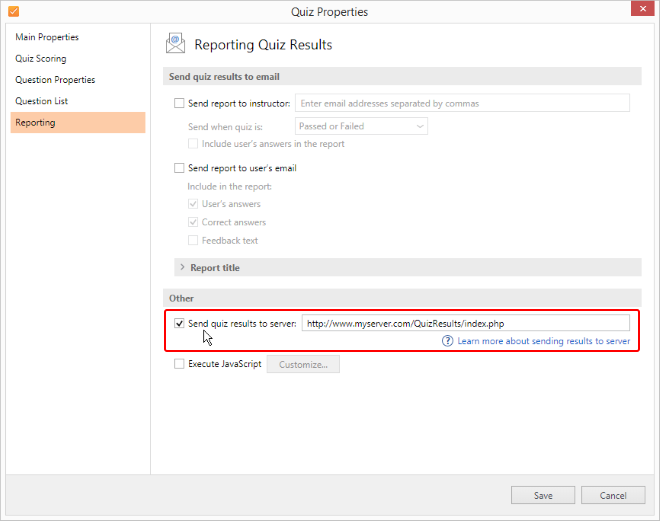
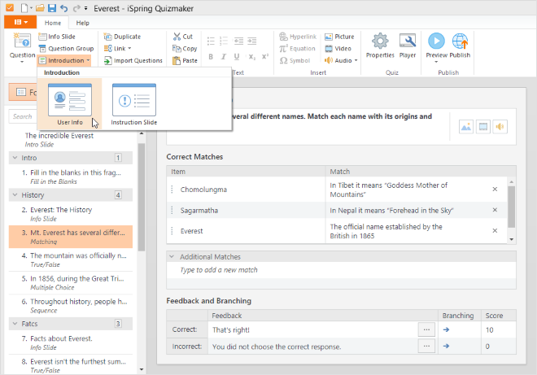
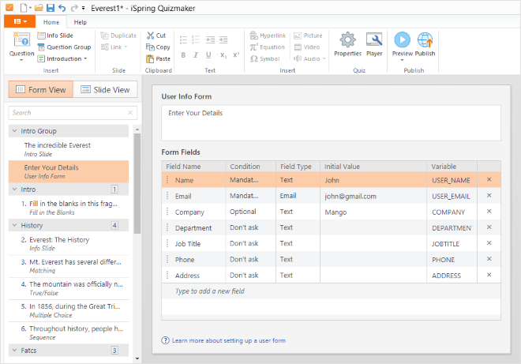
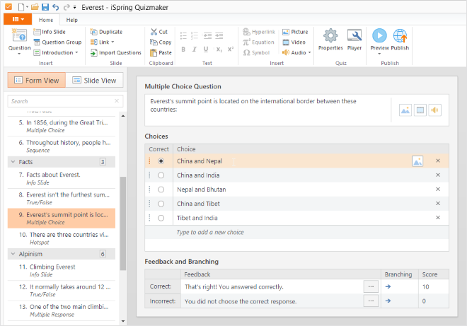
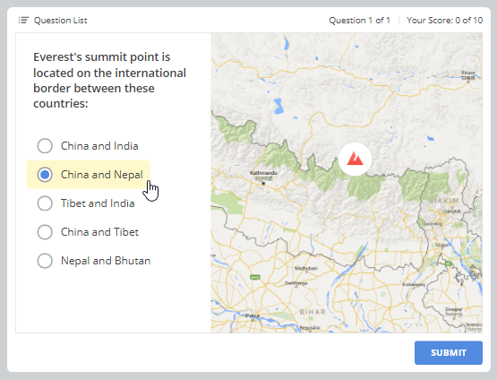
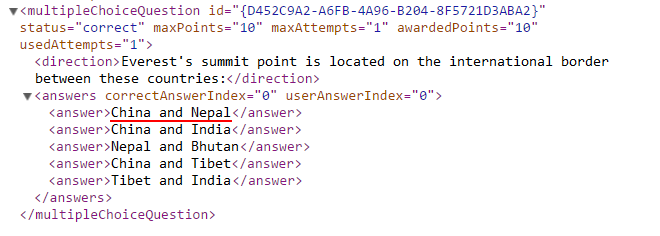

# How to Send Quiz Results to Server

iSpring QuizMaker provides a variety of ways to deliver results. If a [Learning Management System](https://www.ispringsolutions.com/ispring-learn) that automatically tracks quiz progress is not an option in your case, you can also send results via email or send quiz results to server, which will be the main topic of this article.

With this approach, you may build your own tracking system on your server. This advanced solution will require additional development and may incur extra costs, depending on the requirements for creating your custom system.

## PHP sample script

This script is provided “as is” with a text instruction inside and description in this article. 
No support is provided for modifying it or setting up on your server.

## Prerequisites
* A copy of [iSpring QuizMaker](https://www.ispringsolutions.com/ispring-quizmaker) or another iSpring authoring tool that includes QuizMaker ([iSpring Suite](https://www.ispringsolutions.com/ispring-suite)).
* A server with full access to the file directory and to configuration settings.
* Server-side application programming skills (PHP or C#, SQL, XML).

## Quiz configuration
Turn on the Send quiz results to server option in Quiz Properties. In order to do that, follow these steps:
1. Open an existing quiz or create a new one.
2. Select **Properties** on the QuizMaker toolbar.

3. Then select **Reporting** on the left.
4. Check the **Send quiz result to server** checkbox and enter the address of your server that points to a parsing server script (which will be described later in the article).

5. Save settings.
6. **Publish** your quiz.

## List of variables used by QuizMaker
On each user attempt, the Quiz sends all necessary information that can be used for an assessment. Results include the quiz taker’s name or email, whether the quiz has been passed or not, as well as the completion score and detailed results if necessary.

Quizzes generated with iSpring QuizMaker send results using the HTTP POST method. The table below contains all the POST variables that a quiz sends.

| Variable  |  Description | Comment  | Version  |
| ------------ | ------------ | ------------ | ------------ |
| v  | QuizMaker version  |[empty]| 6, 7, 8, 9  |
| **dr**  | [Detailed results](https://www.ispringsolutions.com/articles/sending-quiz-results-to-server#detailed_results) in .xml format  | optional, when available  | 6, 7, 8, 9  |
| sp  | Earned points  | optional, when available  | 6, 7, 8, 9  |
| ps  | Passing score  | optional, when available, depends on the Passing Score option  | 6, 7, 8, 9  |
|  psp |Passing score in percent (the percentage of the total points the user must score to pass a quiz) | optional, when available, depends on the Passing Score option | 6, 7, 8, 9     |
| tp | Gained score | optional, when available | 6, 7, 8, 9  |
| sn | Quiz taker's username | optional, when available, deprecated in version 7, use USER_NAME instead | 6, 7, 8  |
|  sn | Quiz taker's username | optional, when available, deprecated in version 7, use USER_NAME instead | 6, 7, 8  |
|  se | Quiz taker's email address | optional, when available, deprecated in version 7, use USER_EMAIL instead | 6, 7, 8, 9  |
|  qt | Quiz title |[empty]| 6, 7, 8, 9  |
|  t | Quiz type |[empty]| 7, 8, 9  |
| rt | An .xml quiz report template for generating a message | optional, when available | 7, 8  |
|  ae | Instructor's email address | optional, when available | 9  |
| aa | Include user responses in instructor’s report | optional, when available | 9  |
|  rf | Name of the sender of the email with quiz results (the From field) | optional, when available | 9  |
| rs | Subject of the email with quiz results (the Subject field) | optional, when available | 9  |
|  rc | Comment in the email with quiz results (the Comment field) | optional, when available | 9  |
|  rm | Translations of messages according to their identifiers | optional, when available | 9  |
| sid | User ID | optional, when available | 7, 8, 9  |
| tl | Time limit | optional, when available | 7, 8, 9  |
| ut | Used time | optional, when available | 7, 8, 9  |
| fut | Time spent on taking the quiz (with time format specified) | optional, when available | 9  |

####   These variables are available if a quiz has a user data request form:  
| Variable  | Description | Comment | Version |
| ------------- | ------------- | ------------- | ------------- |
|  [user variable]  | \[value of a user variable] | depends, see [description](https://www.ispringsolutions.com/articles/sending-quiz-results-to-server#ps_details) below | 7, 8, 9  |
|  USER_NAME | Quiz taker's username | user variable | 7, 8, 9  |
| USER_EMAIL | Quiz taker's email address | user variable | 7, 8, 9  |
| pv | User variables |[empty]|9|
| sa | Include user responses in quiz taker's report | optional, when available | 9  |
| sc | Include user's correct answers in quiz taker report | optional, when available | 9  |
|  sf | Include feedback messages in quiz taker report | optional, when available | 9  |
|  vt | Array of available user variables | Each array item is an array with two labeled items: id (contains variable id, ex. "COMPANY") and title (contains variable title, ex. "Company") | 7, 8, 9  |

*Note: QuizMaker will send either **ps** or **psp**. This depends on the Passing Score option (Quiz Properties > Main). If it’s specified in points, the program will send **ps** and **psp** if in percentage.*

### User variables
You can add any custom variable that can be used for your exact task. There are some pre-set user variables, name and email and other that you can customize. Here is how you can manage your quiz variables:

1. Select **Introduction > User Info** on the QuizMaker toolbar.

2. Customize Quiz Taker form.

After that when a quiz is published and launched, a user will see a Quiz Taker Form with three fields and default values that can be changed.

A user variable can be **Optional** or **Mandatory**. If you choose **Do not ask**, it won’t be accessible.

Examples of **user variables**:

    USER_NAME = "John"

    USER_EMAIL = "John@gmail.com"

    COMPANY = "Mango"

Example of a **vt** array:

     vt = [{id:USER_NAME, title:"Name"}, {id:USER_EMAIL, title:"Email"}, {id:COMPANY, title:"Company"}]

Variable title is used in user interface (conforms with **Field Name** in the **Customize Quiz Taker Form** window).

## Detailed results

QuizMaker captures every step of a user’s progress and can provide a very precise description of the entire attempt. Detailed results include the text of every question, settings, a list of preset answers, and the user’s choice or answer text. This adds up to a lot of data; therefore, it has to be well-structured.

Detailed results are sent in .xml format within the **dr** variable.

Here is an XML schema that describes the structure of the detailed results .xml:

https://github.com/ispringsolutions/QuizResults/blob/master/QuizReport.xsd

Let's review an example that will show how the detailed answers are captured.

[Download Everest quiz →](https://cdn4.ispringsolutions.com/demos/ispring-suite/everest-1/everest_quiz.zip?_ga=2.226067802.1143274771.1563782940-1479125385.1562764455)

Follow these steps to get the detailed results:

1.  Open the QuizMaker editing window. Switch to the question about the “Everest's summit point” which is a Multiple Choice question, meaning that it can have just a single correct answer: “China and Nepal.”

2.  Here is the published version of this quiz. Let’s select the “China and Nepal” answer and click **Submit**.

3. After the quiz has been finished and the results are sent to the server, we can check this data. Here is the piece of the detailed results XML file featuring this exact question:

Every question is automatically assigned with a unique ID. The attributes of the element provide the summary of the given question: the answer status (correct or incorrect), the maximum points a user can get for the correct answer, the maximum number of attempts allowed, the points that a quiz taker was awarded for this question, and the number of attempts used.

In this case, the user answered the question correctly (status="correct"), spent one attempt (usedAttempts="1") out of one (maxAttempts="1"), and got 10 points for it (awardedPoints="10") out of 10 (maxPoints="10").

The multiple choice question contains 5 possible answers. Each answer has an index whose numeration starts with zero: 0, 1, 2, 3, 4.

“China and Nepal” is the first in the list (correctAnswerIndex=”0”).

Hint: Use your browser’s Developer Tools (F12) to see the contents of a POST request, including this XML file. For a free third-party solution that’s popular among experts, try [Fiddler](https://www.telerik.com/fiddler) by Telerik.

Here is the full transcript of this attempt:
http://www.ispringsolutions.com/download/samples/quizmaker/olympic-games/Olympic-Games-Quiz-results.pdf

## Creating a PHP script
In order to receive these variables, you need to have a **script** placed at the address you specified in the quiz settings.

The next step will be to create a script that will process quiz results and deploy it on your server. It will listen for incoming POST data of a certain format. As soon as data is received, the script will parse it and save to a .txt file or write to a database.

This PHP code collects the POST values sent from a quiz:

$version = $_POST['v'];

$points = $_POST['sp'];

$passing_percent = $_POST['psp'];

$gained_score = $_POST['tp'];

$username = $_POST['sn'];

$email = $_POST['se'];

$quiz_title = $_POST['qt'];

$detailed_results_xml = $_POST['dr']; //This variable will return an xml file.

$_POST is an associative array of variables passed to the current script via the HTTP POST method. So all you need to do is address the necessary variables (listed in the table above) and parse the XML file stored in the **dr** variable.

Here is a **sample PHP script** to check out how Quiz and server communication works.

[https://github.com/ispringsolutions/QuizResults>](https://github.com/ispringsolutions/QuizResults) 

*Description: This script will parse attempt details and write it to a .txt file. The text of results will include user name and email, user score and passing score. Question details will include the question body, correct response, user response and score for this question.*

Indeed, this is a very basic script just for test purposes. To create a good tracking system, you need to develop it on your own.

## Support Note

We at iSpring are always eager to help our users achieve their goals. Please understand that this particular topic is quite complicated and related to the development of third-party systems rather than to QuizMaker’s own functionality (which of course is covered by our [free support](https://www.ispringsolutions.com/maintenance-and-support-services-agreement) service).

If you need help with customization or modification of any scripts related to QuizMaker data collection, we will be happy to provide you with our [consulting services](https://www.ispringsolutions.com/consulting.html), or start a custom development project for an additional fee. Contact us at [support](https://www.ispringsolutions.com/support/contact) for details.

You are welcome to collaborate with other iSpring users and fellow developers by posting on our official [Github page](https://github.com/ispringsolutions) to discuss and share scripts for different purposes.